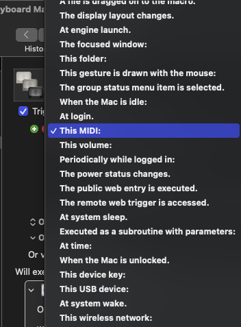
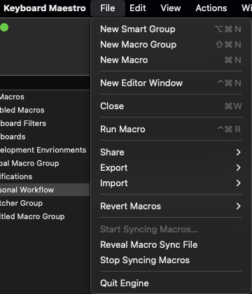

# pip-daily

Update your PIP Daily Updates with One Keystroke

### Requirements

* [Keyboard Maestro](https://www.keyboardmaestro.com/main/)
* python3
* Linux or MacOS

### Install

### Step 0. Set environtment variable

```
export LCUSERNAME=<leetcode username>
```


#### Step 1.

Copy the lcstats.py to /usr/local/bin/ or anywhere else you desire to run your script

#### Step 2.

Open Keyboard Mastro

File > Import > Import Macro to Library


Navigate to the location of the update-pip.kmmacros file.

Select and click Import

#### Step 3.

Program your desired key(s) to trigger your automation. I am using a MIDI board but there are many options.

* Check the "MIDI Learn" box and then type the keys you'd like to use.
  

#### Step 4.

You can minimize the window and test your trigger.


